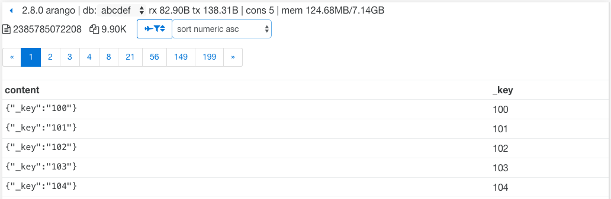

# ArangoDB-view
`dentist removed much candy`

ArangoDB-view is a poc webinterface for [ArangoDB](http://github.com/arangodb/arangodb). Its based on a flex design.

#### features
* actually displays right converted bytes (1000 B = 1 KB)
* always to your left, collections overview (can be hidden)
* always to your top, basic infos / stats
* show all available updates
* open links in a new tab
* easily create rules that filter and sort documents
* pagination is saved when you edit a document and return to documents overview
* next / prev document while in single document view
* management collections / edges
  * reload collection properties and indexes on demand
  * navigate to documents
  * load / unload
  * truncate
  * rotate journal
  * change journal size in MiB and MB
  * change waitForSync
  * change indexBuckets
  * rename collection
  * create new collections specify
    * name
    * type
    * wait for sync y/n
    * volatile y/n
    * system collection y/n
    * compaction y/n
    * journal size
    * index buckets

#### whats next?
* link _from / _to
* delete documents
* run AQL queries
* query log
* authentication


documents overview


documents overview with hidden collectionsbar


sort documents desc


show documents with _key < 110 and sort documents asc


editing json in object mode


editing json in code mode


disabled save / view change due to error


show available version for update


### install
#### mount point
for now the mount point must be `/view`.

#### filter/sort documents
##### create a new filter/sort rule
First select the none rule and change `// none` to your rule name.
You may have to klick on the direct left button from the rule selection to reveal the rule input field.
Now you can edit your rule as native AQL statements. The current document can be accessed via `doc`. Let's create a rule that filters all _key smaller than 10.
```
01: // filter ._key < 10
02: filter to_number(doc._key) < 10
```
Line 1 is the name of the rule
Line 2 is the AQL statement that will filter all _keys samller 10. Note the conversion to a number first.
After a short timeout your new rule is automatically saved and applied to the documents overview. When you click outside from the input field the edited rule is also saved and applied.

##### edit filter/sort rule
To edit a rule just type the new rule into the rule input field. The rule is automatically save and applied when you click outside.

##### create new rule from existing rule
First change the rule name, then edit the rule. The new rule is saved automatically.
